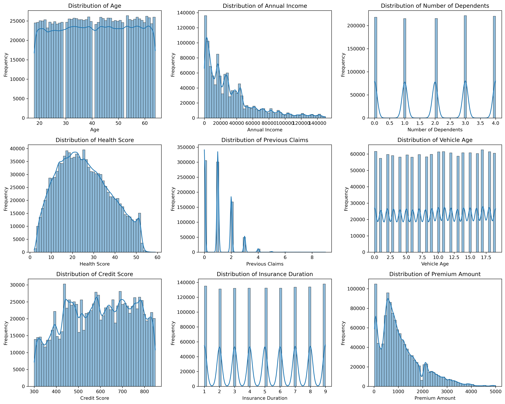
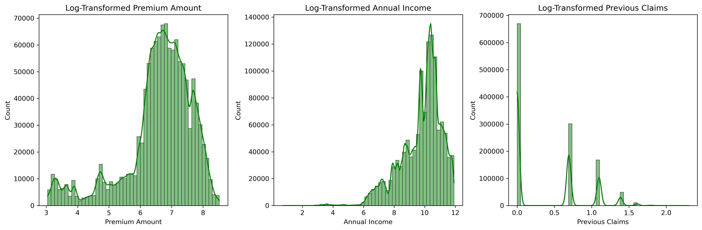
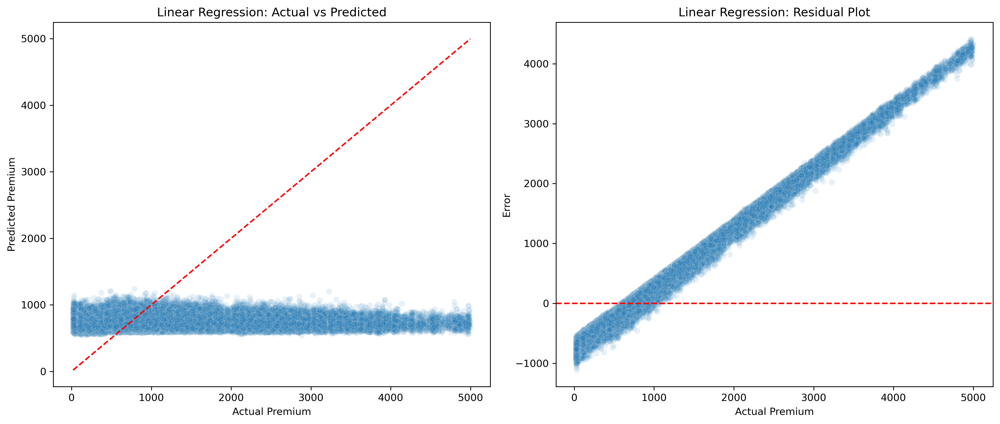
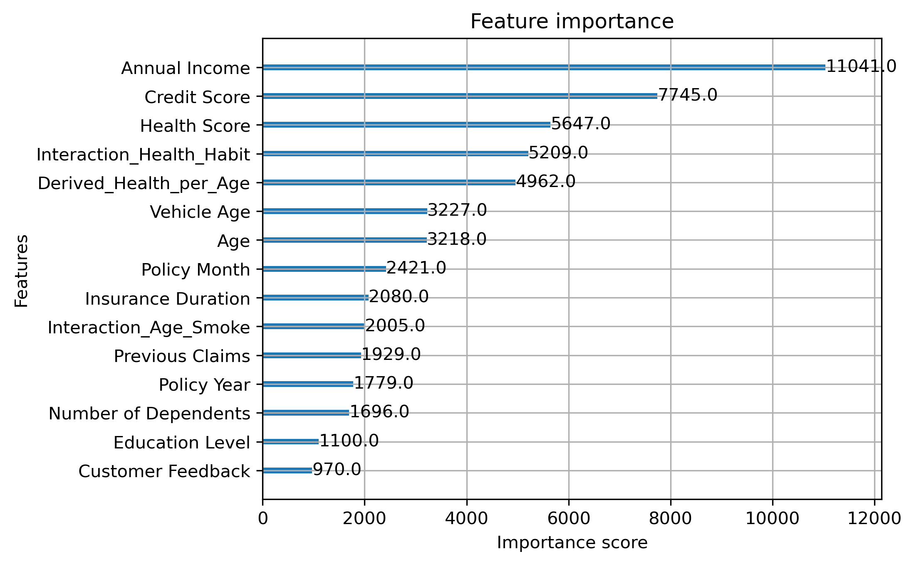
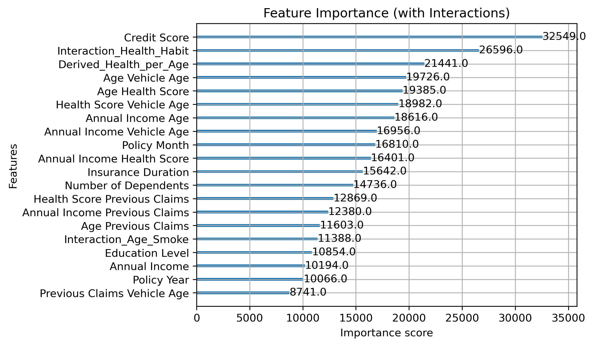
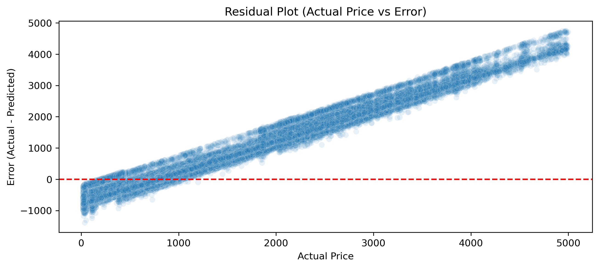
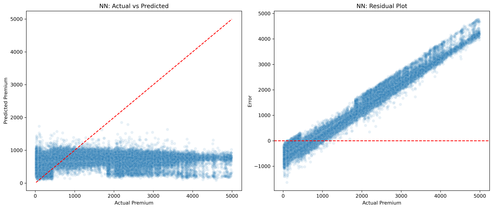

<!--
_class: lead
_paginate: false
_header: ""
-->

# 전산통계 기말 실습 과제 : 보험료 예측 데이터셋
<!-- 왼쪽 정렬을 대체하여 빈 공백 유니코드 사용 -->
ㅤㅤㅤㅤㅤㅤㅤㅤㅤㅤㅤㅤㅤㅤㅤㅤㅤㅤㅤㅤㅤㅤㅤㅤㅤㅤㅤㅤㅤㅤㅤㅤㅤㅤㅤㅤㅤㅤㅤㅤㅤㅤ12213030 노동주
## 1 데이터셋 및 문제 소개

### 1.1 데이터셋 개요 : Regression with an insurance Dataset (kaggle 번역)

본 대회에 사용된 데이터셋(학습 및 테스트)은 보험료 예측 데이터셋으로 학습된 딥러닝 모델을 기반으로 생성되었습니다. 특징 분포는 원본 데이터셋과 유사하지만 완전히 동일하지는 않습니다. 원본 데이터셋을 사용하여 차이점을 살펴보거나, 원본 데이터셋을 학습에 포함했을 때 모델 성능이 향상되는지 확인해 보셔도 좋습니다.

train.csv - 학습 데이터셋; 보험료 금액은 연속형 변수입니다.
test.csv - 테스트 데이터셋; 각 행에 대해 목표 보험료 금액을 예측하는 것이 목표입니다.
sample_submission.csv - 제출해야 할 샘플 파일 (올바른 형식)
### 1.2 문제 정의
보험 산업에서 정확한 보험료 산정(Premium Pricing)은 회사의 수익성을 보장하고 가입자들에게 공정한 요율을 제시하기 위한 핵심 과제이다. 본 프로젝트의 목표는 고객의 인구통계학적 정보, 건강 상태, 과거 보험 이력 등 다양한 특성(Features)을 기반으로 적정 보험료(Premium Amount)를 예측하는 회귀(Regression) 모델을 구축하는 것이다. 특히, 본 데이터셋은 실제 보험료 책정 로직의 복잡성과 데이터 분포의 편향(Skewness)을 반영하고 있어, 단순한 패턴 인식을 넘어 이상치(Outlier)에 강건(Robust)하고 비선형적인 관계를 효과적으로 학습할 수 있는 모델링 기법이 요구된다.

### 1.3 평가 지표
모델의 예측 성능을 측정하기 위해 다음과 같은 두 가지 지표를 사용한다. 모든 평가는 로그 변환된 값을 원래의 스케일로 복원(np.expm1) 한 실제 보험료 금액을 기준으로 수행한다.

1.  **MAE (Mean Absolute Error, RMSLE 대체):**
    *   $\text{MAE} = \frac{1}{n} \sum_{i=1}^{n} |y_i - \hat{y}_i|$
    *   실제 값과 예측 값의 차이(오차)의 절댓값 평균이다.
    *   **선정 이유:** 보험료 데이터와 같이 이상치가 존재하는 경우, 오차를 제곱하는 MSE(Mean Squared Error)보다 이상치에 덜 민감하여 모델의 일반적인 성능을 평가하기에 적합하다.

2.  **$R^2$ Score (Coefficient of Determination):**
    *   $R^2 = 1 - \frac{\sum (y_i - \hat{y}_i)^2}{\sum (y_i - \bar{y})^2}$
    *   데이터의 총 변동(Variance) 중 모델이 설명할 수 있는 변동의 비율을 나타냅니다.
    *   **선정 이유:** 단순히 오차의 크기뿐만 아니라, 모델이 전체 데이터의 패턴을 얼마나 잘 설명하고 있는지(Goodness of Fit)를 직관적으로 파악하기 위해 사용한다.
    *   *참고:* 베이스라인 실험 단계에서는 음수가 나올 수 있으며, 이는 모델이 단순 평균 예측보다 성능이 낮음을 의미한다.
---

## 2 데이터 탐색 및 전처리

### 2.1 데이터 탐색 (EDA)

본 프로젝트에서 사용된 데이터셋은 약 120만 개의 샘플과 21개의 컬럼으로 구성되어 있다. 효율적인 모델링을 위해 데이터의 구조와 특성을 파악하는 초기 탐색 과정을 수행하였다.

* **데이터 분포의 불균형 (Skewness):** 히스토그램 시각화 결과, 입력 변수인 Annual Income과 Previous Claims가 극도로 오른쪽으로 치우친(Right-Skewed) 분포를 보임을 확인하였다. 이러한 왜도는 모델이 소수의 큰 값(Outlier)에 과도하게 영향을 받게 하여 학습을 방해할 수 있다.
* **타겟 변수(Premium Amount)의 특성:** 예측 대상인 보험료 역시 낮은 금액대에 데이터가 몰려 있고 고액 보험료 구간은 길게 꼬리가 늘어지는 롱테일(Long-tail) 분포를 보였다. 이는 일반적인 회귀 모델이 평균값 예측에만 집중하게 만드는 원인이 될 수 있다.
* **결측치 현황:** 일부 수치형 및 범주형 변수에서 결측치가 발견되었으며, 이를 적절히 처리하지 않을 경우 모델 성능 저하로 이어질 수 있음을 확인하였다.

---

### 2.2 전처리 (Data Preprocessing)

EDA를 통해 파악한 문제점을 해결하고 모델 학습에 최적화된 데이터를 만들기 위해 다음과 같은 전처리 과정을 수행하였다.

1. **결측치 처리 (Imputation):** 수치형 변수의 결측치는 전체 데이터의 **평균(Mean)**값으로 대체하였으며, 범주형 변수는 최빈값(Mode) 또는 'Unknown'이라는 별도 범주로 처리하여 정보 손실을 최소화하였다.
2. **범주형 변수 인코딩:**
   * 순서가 있는 변수(Ordinal)는 수치 매핑을 통해 순서 정보를 보존하였다.
   * 순서가 없는 명목형 변수(Nominal)는 One-Hot Encoding을 적용하여 모델이 편향 없이 학습할 수 있도록 변환하였다.
3. **날짜 데이터 처리:** Policy Start Date에서 연도(Year)와 월(Month) 정보를 추출하여 파생 변수로 추가함으로써, 시간에 따른 추세나 계절성을 반영할 수 있도록 하였다.
4. **로그 변환 (Log Transformation):** 분포의 치우침이 심한 Annual Income, Previous Claims 및 타겟 변수인 Premium Amount에 np.log1p 로그 변환을 적용하였다. 이를 통해 데이터 분포를 정규분포에 가깝게 보정하였으며, 이상치의 영향력을 줄이고 모델 학습의 안정성을 확보하였다.

## 3. 베이스라인 모델 (Linear regression)

본격적인 모델링에 앞서, 데이터의 복잡도와 피처들의 설명력을 가늠하기 위해 가장 기본적인 형태의 회귀 모델인 다중 선형 회귀(Multiple Linear Regression)를 베이스라인으로 설정하였다.

### 3.1 실험 설계

* **데이터 분할 (Train/Validation Split):** 모델의 일반화 성능을 평가하기 위해 학습 데이터(80%)와 검증 데이터(20%)로 분할하였다.
* **피처 스케일링 (Scaling):** 선형 모델의 특성상 변수 간 스케일 차이에 민감할 수 있으므로, StandardScaler를 적용하여 모든 수치형 변수를 표준 정규분포 형태로 변환하였다.
---

### 3.2 실험 결과 및 분석

* **평가 지표:**

  * **MAE (Mean Absolute Error):** 650.78
  * **$R^2$ Score:** -0.18
* **결과 해석:**
  실험 결과, $R^2$ 점수가 음수(-0.18)로 나타났다. 이는 모델이 데이터의 패턴을 전혀 설명하지 못하고 있으며, 단순히 타겟 변수의 평균값으로 예측하는 것보다 성능이 떨어짐을 의미한다.

  주요 원인은 다음과 같이 분석된다:

  1. **비선형성 (Non-linearity):** 보험료 책정 로직은 변수들의 단순 선형 결합(예 : y = wx + b)이 아닌, 복잡한 비선형 관계나 조건부 규칙(IF-THEN)으로 이루어져 있을 가능성이 높다.
  2. **낮은 상관관계:** 주요 변수와 타겟 변수 간의 피어슨 상관계수를 분석한 결과, 가장 높은 상관계수조차 0.05 미만으로 나타났다. 이는 개별 변수 하나하나가 보험료에 미치는 직접적인 영향력이 매우 미미함을 시사한다.

따라서, 단순한 선형 모델로는 이 데이터셋을 공략할 수 없음을 확인하였으며, 비선형 패턴을 학습할 수 있는 트리 기반 모델(XGBoost)과 신경망 모델(Neural Network)의 도입이 필수적이라는 결론을 도출하였다.

---

## 4. 초기 가설 및 비교 모델 (XGBoost)

베이스라인 모델의 실패를 통해 데이터에 강한 비선형성이 존재함을 확인하였다. 이에 따라, 비선형 패턴 학습에 탁월한 성능을 보이며 캐글 등 데이터 분석 대회에서 널리 검증된 XGBoost (eXtreme Gradient Boosting) 알고리즘을 도입하여 2단계 실험을 진행하였다.

---

### 4.1 순정 모델 (1차 실험)
*   **가설:** 의사결정나무(Decision Tree)를 앙상블(Ensemble)하는 부스팅 기법을 사용하면, 선형 모델이 놓친 복잡한 데이터 패턴과 변수 간 상호작용을 포착할 수 있을 것이다.
*   **실험 설정:** 과도한 튜닝 없이 XGBoost의 기본(Default) 하이퍼파라미터 설정으로 학습을 수행하여 모델 자체의 잠재력을 평가하였다.
*   **최종 결과:**
    *   **MAE:** 624.36
    *   **$R^2$:** -0.16
*   **결과 해석:** 베이스라인 대비 소폭의 성능 향상은 있었으나, 여전히 높은 오차율을 보였으며 고액 보험료 예측에서의 성능 저하 문제가 지속되었다.

### 4.2 하이퍼파라미터 튜닝 및 입력 변수 변환 (2차 실험)
1차 실험의 한계를 극복하기 위해 모델의 복잡도를 높이고 데이터 분포를 더욱 정교하게 보정하는 심화 실험을 수행하였다.

---

*   **입력 변수 로그 변환:** 타겟 변수뿐만 아니라, 입력 변수 중 심한 왜도를 보인 Annual Income과 Previous Claims에도 np.log1p 변환을 적용하여 트리의 분기(Split) 효율을 높이고자 하였다.
*   **파라미터 튜닝:** GridSearchCV 등을 활용하여 학습률(learning_rate), 트리의 개수(n_estimators), 깊이(max_depth) 등을 최적화하였다. (최종 설정: n_estimators=1000, learning_rate=0.05)
*   **최종 결과:**
    *   **MAE:** 623.99
    *   **$R^2$:** -0.15
*   **잔차 분석 (Residual Analysis):** 잔차 플롯(Residual Plot) 시각화 결과, 예측 값과 실제 값의 차이가 고액 보험료 구간으로 갈수록 선형적으로 증가하는 우상향 패턴이 뚜렷하게 나타났다. 이는 모델이 고액 보험료 데이터를 체계적으로 과소평가(Systematic Under-prediction)하고 있음을 의미하며, 이는 단순한 모델 튜닝으로 해결될 문제가 아님을 강력하게 시사한다.

### 4.3 1차 결론 및 인사이트 도출
XGBoost 모델 실험을 통해 MAE 600의 벽을 확인하였다. 이는 본 데이터셋의 문제가 모델의 성능 부족이 아니라, 예측에 필수적인 핵심 정보(예: 차량 가액, 구체적인 보장 내용 등)가 데이터에 부재하기 때문으로 판단된다.

실제로 본 대회의 상위권 입상자들의 솔루션을 분석한 결과, 논리적인 도메인 지식보다는 수천 개의 파생 변수(Interaction Features)를 생성하고 조합하는 고도의 피처 엔지니어링이 성능 향상의 핵심이었음을 확인하였다. 이는 우리가 직면한 한계가 합리적인 추론의 영역을 벗어난, 데이터 마이닝(Data Mining) 영역의 문제임을 역설적으로 보여준다.

## 5. 가설 수정 및 신경망 모형과의 비교 (MLP)

### 5.1 가설 수정: 자동화된 피처 추출의 가능성
XGBoost 실험을 통해, 기존 변수들의 선형적 결합이나 단순한 트리 분기만으로는 고차원적인 패턴을 포착하기 어렵다는 결론에 도달했다. 이에 따라, 수동적인 피처 엔지니어링 대신 데이터 내의 복잡한 비선형 관계와 잠재된 특징(Latent Features)을 스스로 학습할 수 있는 인공신경망(Artificial Neural Network) 모델을 도입해 보기로 하였다.

### 5.2 모델 설계 및 실험
*   **모델 구조:** sklearn.neural_network.MLPRegressor를 사용하여 입력층과 출력층 사이에 3개의 은닉층(Hidden Layers, 노드 수: 128-64-32)을 배치한 다층 퍼셉트론(MLP) 모델을 설계하였다.
*   **전처리:** 데이터의 스케일에 민감한 신경망의 특성을 고려하여 StandardScaler를 적용, 학습 안정성을 확보하였다.
*   **학습 설정:** 비선형성을 확보하기 위해 ReLU 활성화 함수를 사용하였으며, 최적화 알고리즘으로는 Adam을 채택하였다.

---

### 5.3 실험 결과 및 최종 비교
*   **최종 성과:**
    *   **MAE:** 633.52
    *   **$R^2$ Score:** -0.16
*   **분석:**
    실험 결과, 딥러닝 모델 역시 XGBoost(MAE 624.36)와 통계적으로 유의미한 차이가 없는 성능을 기록하였다. 특히, 잔차 분석에서도 XGBoost와 동일한 형태의 고액 구간 예측 실패 패턴이 관측되었다.
    
    이로써, 본 프로젝트의 낮은 성능 원인은 모델의 표현력 부족이 아니라 입력 데이터(Features)가 타겟 변수(Target)를 설명하기에 충분한 정보를 담고 있지 않다는 '정보의 한계(Information Limitation)'에 있음을 최종적으로 확인할 수 있었다.

## 6. 최종 결론

본 프로젝트를 통해 선형 회귀(Linear Regression), XGBoost, 인공신경망(MLP) 등 다양한 기계학습 모델을 적용하여 보험료 예측을 시도했으나, 모든 모델이 약 620~650 수준의 MAE에서 성능이 정체되는 현상을 관찰하였다.

특히, 잔차 분석을 통해 밝혀낸 "모든 모델이 고액 보험료 구간에서 예측에 실패한다"는 사실은 본 연구의 가장 중요한 발견이다. 이는 현재 데이터셋에 보험료 산정에 필수적인 핵심 변수(예: 차량 가액, 구체적 사고 이력 등)가 누락되어 있음을 시사한다. 따라서, 데이터 과학 관점에서 본 프로젝트의 결론은 다음과 같다:

1.  **모델링의 한계:** 데이터에 정보가 없을 경우, 아무리 복잡한 모델(Deep Learning 등)을 사용해도 성능 향상에는 한계가 있다 ("Garbage In, Information Limit Out").
2.  **피처 엔지니어링의 중요성:** 캐글 우승 사례에서 확인했듯이, 이 문제를 해결하기 위해서는 단순한 통계적 기법을 넘어선 대규모 상호작용 변수(Interaction Features) 생성과 같은 공격적인 피처 엔지니어링이 필수적이다.

결론적으로, 본 연구는 비록 목표 성능(MAE < 600)을 달성하지는 못했으나, 체계적인 실험과 잔차 분석을 통해 "데이터 자체의 한계"를 체계적으로 입증했다는 점에서 의의를 가진다.

---

## 7. 한계점 및 향후 과제

본 연구 과정에서 직면한 주요 한계점들은 다음과 같으며, 이는 추후 연구를 위한 개선 방향이기도 하다.

1.  **컴퓨팅 리소스의 제약:** 캐글 우승자들이 수행한 'Brute-force Feature Engineering'(수만 개의 파생 변수 조합 및 테스트)은 제한된 단일 GPU 환경에서 재현하기 어려웠다. 클라우드 컴퓨팅 등을 활용한 대규모 연산이 가능하다면 더 많은 변수 조합을 탐색해 볼 수 있을 것이다.
2.  **데이터의 본질적 한계 (Synthetic Dataset):** 본 데이터셋은 실제 데이터가 아닌 딥러닝 모델로 생성된 가상 데이터셋이다. 이로 인해 현실 세계의 인과관계(Causality)가 일부 왜곡되거나, 생성 모델의 편향이 데이터에 그대로 반영되었을 가능성이 존재한다.
3.  **외부 데이터 활용 부재:** 차량 모델명이나 지역별 사고율 통계 등 보험료에 결정적인 영향을 미칠 수 있는 외부 데이터를 결합(Merge)하지 못했다. 실제 데이터에서는 이러한 외부 데이터를 적극적으로 도입하여 모델의 설명력을 보강할 필요가 있다.

### (부록) 깃허브 링크 : [https://github.com/pluto2477/ML_final_report](https://github.com/pluto2477/ML_final_report)